# E-Commerce Data Analysis

This project outlines a comprehensive set of analyses to be performed on an e-commerce dataset, ranging from basic metrics to advanced business intelligence and predictive modeling.  

step by step data processing and analysis are stored here: https://docs.google.com/document/d/1abebqsE34jJFqVtDfr_EtFKU9kB2iUx5ocDSNXNeU14/edit?usp=sharing

Before beginning I want to show you what I have gained from this Data Analysis project.
## Data Analysis Skills Gained

Throughout this analysis, the following data analysis skills and techniques were developed and applied:

1. **Data Preprocessing**:
   - **Exploring Schemas, Columns, and Nulls**: Understanding the structure of the dataset, identifying columns, and checking for null values.
   - **Duplicates**: Identifying and handling duplicate records in the dataset.
   - **Missing Values**: Handling missing values by imputing or removing them.
   - **Data Types Conversion**: Converting data types to ensure consistency and compatibility.

2. **Anomaly Detection**:
   - Identifying outliers using statistical methods like percentiles and z-scores.
   - Applying conditional logic to flag anomalies in the data.

3. **Pricing and Revenue Analysis**:
   - Analyzing the impact of price changes on sales and revenue.
   - Using lag functions to compare current and previous values.

4. **Customer Segmentation**:
   - Segmenting customers based on RFM (Recency, Frequency, Monetary) values.
   - Creating views to store segmented data for further analysis.

5. **Churn and CLTV Analysis**:
   - Calculating churn rates and Customer Lifetime Value (CLTV) using cohort analysis.
   - Understanding customer retention and lifetime value for strategic decision-making.

6. **Product Recommendation**:
   - Identifying frequently purchased products and subcategory combinations for bundling.
   - Using market basket analysis to find product pairs that are often bought together.

7. **Elasticity Analysis**:
   - Calculating price elasticity of demand to understand how price changes affect quantity demanded.
   - Applying linear regression and logarithmic transformations to calculate elasticity.


## Tools and Functionalities Used

1. **Data Aggregation and Grouping**:
   - Summarizing data using `COUNT`, `SUM`, `AVG`, and `GROUP BY`.
   - Understanding how to aggregate data at different levels (e.g., monthly, quarterly, yearly).

2. **Conditional Logic**:
   - Using `CASE` statements to create new categorical variables (e.g., age groups, gender labels).
   - Applying conditional logic to filter and segment data.

3. **Date and Time Manipulation**:
   - Extracting and formatting dates using `TO_CHAR`, `DATE_TRUNC`, and `EXTRACT`.
   - Calculating time differences and cohort analysis using date functions.

4. **Window Functions**:
   - Using window functions like `NTILE`, `LAG`, and `DENSE_RANK` to perform advanced analytics.
   - Understanding how to partition data and apply window functions for ranking and trend analysis.

5. **Common Table Expressions (CTEs)**:
   - Utilizing `WITH` clauses to create temporary result sets for complex queries.
   - Breaking down complex problems into manageable parts using CTEs.

6. **Joining Tables**:
   - Joining multiple tables to combine data from different sources.
   - Understanding different types of joins (e.g., `INNER JOIN`, `LEFT JOIN`, `CROSS JOIN`, `SELF JOIN`, `FULL OUTER JOIN`) and their applications.

7. **Statistical Functions**:
   - Calculating percentiles, z-scores, and other statistical measures.

8. **Numerical Rounding and Formatting**:
   - Using `ROUND` and data type casting to format numerical data for better readability.
   - Applying numerical rounding to ensure accurate calculations.

9. **Stored Procedures**:
   - Creating and executing stored procedures to encapsulate and reuse complex SQL logic.
   - Using `CREATE PROCEDURE` to define stored procedures for repeated tasks.

10. **PostgreSQL Functions**:
    - Creating user-defined functions using `CREATE FUNCTION` to encapsulate reusable logic.
    - Utilizing SQL languages to define functions for complex calculations and operations.

By applying these skills and techniques, a comprehensive analysis of customer demographics, behavior, and product trends was conducted, providing valuable insights for targeted marketing, product development, and customer retention strategies.


# Customer Demographics and Behavior Analysis

## Target
Analyze customer demographics, behavior, and product trends to optimize marketing strategies and improve customer retention.

## Importance
Understanding customer demographics and behavior is crucial for targeted marketing, product development, and improving customer satisfaction and retention.

## Implementation Steps

### Step 1: Customer Demographics Analysis

1. **Total Customers**:
   - **Description**: Count the total number of unique customers.
   - **Core Function**: `COUNT(DISTINCT customer_id)`
   - **Skills Gained**: Basic SQL aggregation and distinct counting.
   ```sql
   SELECT COUNT(DISTINCT customer_id) FROM orders;
   ```

2. **Total Customers by Age Group**:
   - **Description**: Categorize customers into age groups and count the number of customers in each group.
   - **Core Functions**: `CASE` statements for age grouping, `COUNT`, `GROUP BY`.
   - **Skills Gained**: Conditional logic in SQL, grouping, and aggregation.
   ```sql
   SELECT
       CASE
           WHEN age > 40 THEN 'Above 40'
           WHEN age > 30 THEN '31-40'
           WHEN age > 20 THEN '21-30'
           ELSE '20 or below'
       END AS age_group,
       COUNT(DISTINCT o.customer_id) AS total_customers
   FROM orders o
   LEFT JOIN customers c ON o.customer_id = c.customer_id
   GROUP BY
       CASE
           WHEN age > 40 THEN 'Above 40'
           WHEN age > 30 THEN '31-40'
           WHEN age > 20 THEN '21-30'
           ELSE '20 or below'
       END;
   ```
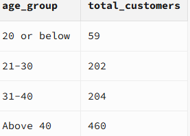

3. **Total Customers by Gender**:
   - **Description**: Count the number of customers by gender.
   - **Core Functions**: `CASE` statements for gender labeling, `COUNT`, `GROUP BY`.
   - **Skills Gained**: Conditional logic, grouping, and aggregation.
   ```sql
   SELECT
       CASE
           WHEN gender = 'F' THEN 'Female'
           WHEN gender = 'M' THEN 'Male'
           ELSE 'Other'
       END AS gender_label,
       COUNT(DISTINCT o.customer_id) AS total_customers
   FROM orders o
   LEFT JOIN customers c ON o.customer_id = c.customer_id
   GROUP BY gender_label;
   ```

4. **Total Customers by Country**:
   - **Description**: Count the number of customers by country.
   - **Core Functions**: `COUNT`, `GROUP BY`.
   - **Skills Gained**: Basic grouping and aggregation.
   ```sql
   SELECT
       o.country,
       COUNT(DISTINCT o.customer_id) AS total_customers
   FROM orders o
   LEFT JOIN customers c ON o.customer_id = c.customer_id
   GROUP BY o.country;
   ```

5. **Total Customers by Gender and Age Group**:
   - **Description**: Count the number of customers by both gender and age group.
   - **Core Functions**: `CASE` statements for gender and age grouping, `COUNT`, `GROUP BY`.
   - **Skills Gained**: Nested conditional logic, grouping, and aggregation.
   ```sql
   SELECT
       gender_label,
       age_group,
       COUNT(DISTINCT customer_id) AS total_customers
   FROM (
       SELECT
           o.customer_id,
           CASE
               WHEN gender = 'F' THEN 'Female'
               WHEN gender = 'M' THEN 'Male'
               ELSE 'Other'
           END AS gender_label,
           CASE
               WHEN c.age > 40 THEN 'Above 40'
               WHEN c.age > 30 THEN '31-40'
               WHEN c.age > 20 THEN '21-30'
               ELSE '20 or below'
           END AS age_group
       FROM orders o
       LEFT JOIN customers c ON o.customer_id = c.customer_id
   ) AS age_gender
   GROUP BY gender_label, age_group;
   ```
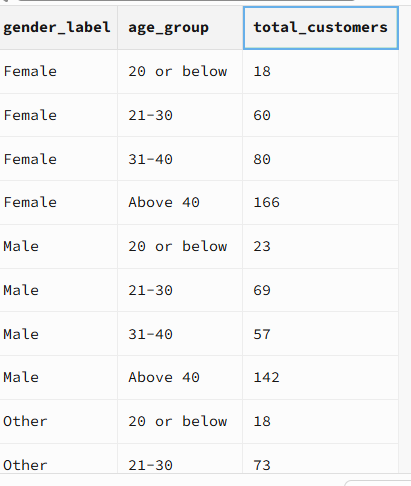

### Step 2: Customer Segmentation

1. **Yearly Income by Customer Segment**:
   - **Description**: Calculate the average yearly income for each customer segment.
   - **Core Functions**: `JOIN`, `ROUND`, `AVG`, `GROUP BY`.
   - **Skills Gained**: Joining tables, aggregation, and numerical rounding.
   ```sql
   SELECT "Customer Segment", ROUND(AVG(yearly_income)) AS AVG_yearly_income
   FROM rfm_segmentation RS
   JOIN customers C ON RS.customer_id = C.customer_id
   GROUP BY "Customer Segment"
   ORDER BY AVG_yearly_income DESC;
   ```
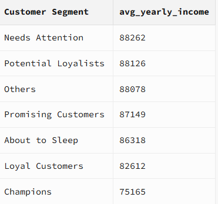

2. **Average Number of Children and Purchasing Behavior**:
   - **Description**: Calculate the average sales amount for customers grouped by the number of children.
   - **Core Functions**: `JOIN`, `ROUND`, `AVG`, `GROUP BY`.
   - **Skills Gained**: Joining tables, aggregation, and numerical rounding.
   ```sql
   SELECT no_of_children, ROUND(AVG("TOTAL SALES AMOUNT")) AS AVG_SALES
   FROM customers C
   JOIN rfm_segmentation RS ON C.customer_id = RS.customer_id
   GROUP BY no_of_children;
   ```
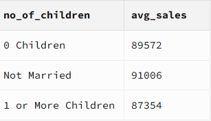

### Step 3: Customer Registration Trends

1. **Monthly Registration Trends**:
   - **Description**: Count the number of customer registrations per month.
   - **Core Functions**: `TO_CHAR`, `DATE`, `COUNT`, `GROUP BY`, `ORDER BY`.
   - **Skills Gained**: Date formatting, grouping, and ordering.
   ```sql
   SELECT
       TO_CHAR(DATE(registration_date), 'YYYY-MM') AS month,
       COUNT(customer_id) AS total_customer_registrations
   FROM customers
   GROUP BY month
   ORDER BY month;
   ```

2. **Quarterly Registration Trends**:
   - **Description**: Count the number of customer registrations per quarter.
   - **Core Functions**: `CONCAT`, `EXTRACT`, `DATE`, `COUNT`, `GROUP BY`, `ORDER BY`.
   - **Skills Gained**: Date extraction, grouping, and ordering.
   ```sql
   SELECT
       CONCAT(EXTRACT(YEAR FROM DATE(registration_date)), '-Q',
       EXTRACT(QUARTER FROM DATE(registration_date))) AS YEAR_QTR,
       COUNT(customer_id) AS total_customer_registrations
   FROM customers
   GROUP BY EXTRACT(YEAR FROM DATE(registration_date)), EXTRACT(QUARTER FROM DATE(registration_date))
   ORDER BY EXTRACT(YEAR FROM DATE(registration_date)), EXTRACT(QUARTER FROM DATE(registration_date));
   ```
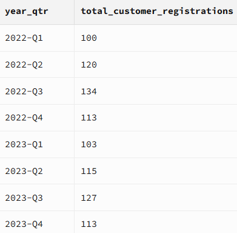


3. **Yearly Registration Trends**:
   - **Description**: Count the number of customer registrations per year.
   - **Core Functions**: `EXTRACT`, `DATE`, `COUNT`, `GROUP BY`.
   - **Skills Gained**: Date extraction and grouping.
   ```sql
   SELECT
       EXTRACT(YEAR FROM DATE(registration_date)) AS YEAR,
       COUNT(customer_id) AS TOTAL_CUSTOMER_REGISTRATION
   FROM CUSTOMERS
   GROUP BY YEAR;
   ```
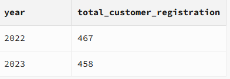


4. **Cities with Highest Registration Rates**:
   - **Description**: Identify the city with the highest registration rate in each country.
   - **Core Functions**: `WITH` (CTE), `DENSE_RANK`, `COUNT`, `GROUP BY`.
   - **Skills Gained**: Common Table Expressions (CTEs), window functions, and ranking.
   ```sql
   WITH TOTAL_REGISTRATIONS AS (
       SELECT country, CITY, COUNT(customer_id) AS TOTAL_REG
       FROM CUSTOMERS
       GROUP BY COUNTRY, city
   ),
   RANKINGS AS (
       SELECT
           country,
           city,
           total_reg,
           DENSE_RANK() OVER (PARTITION BY country ORDER BY total_reg DESC) AS rn
       FROM TOTAL_REGISTRATIONS
   )
   SELECT
       COUNTRY,
       CITY,
       TOTAL_REG
   FROM RANKINGS
   WHERE RN = 1;
   ```
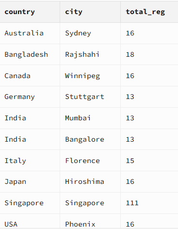


### Step 4: Payment Issues

1. **Rate of Returned or Failed Payments**:
   - **Description**: Calculate the percentage of returned or failed payments.
   - **Core Functions**: `WITH` (CTE), `COUNT`, `ROUND`, `GROUP BY`.
   - **Skills Gained**: Common Table Expressions (CTEs), aggregation, and numerical rounding.
   ```sql
   WITH ALL_STATUS_PERCENTAGE AS (
       SELECT
           ORDER_STATUS,
           COUNT(order_id) AS TOTAL,
           ROUND(COUNT(order_id) / (SELECT COUNT(*) FROM ORDERS)::NUMERIC, 2) AS PERCENTAGE
       FROM orders
       GROUP BY order_status
   )
   SELECT
       SUM(PERCENTAGE) AS PERC_RETURNED_FAILED
   FROM ALL_STATUS_PERCENTAGE
   WHERE order_status IN ('Returned', 'Cancelled');
   ```

### Step 5: Customer Session Behavior

1. **Impact of Device Type or Browser on Session Duration**:
   - **Description**: Calculate the total session hours for each combination of device type and browser.
   - **Core Functions**: `ROUND`, `SUM`, `GROUP BY`, `ORDER BY`.
   - **Skills Gained**: Aggregation, numerical rounding, and grouping.
   ```sql
   SELECT
       device_type,
       browser,
       ROUND(SUM(session_duration) / 60 ::numeric, 2) AS TOTAL_SESSION_HOURS
   FROM SESSIONS
   GROUP BY device_type, browser
   ORDER BY TOTAL_SESSION_HOURS DESC;
   ```
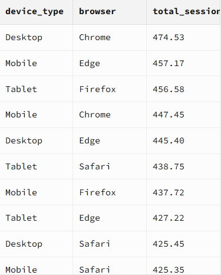

### Step 6: Advanced Customer Segmentation

1. **RFM Segmentation**:
   - **Description**: Create a view to segment customers based on Recency, Frequency, and Monetary value.
   - **Core Functions**: `CREATE OR REPLACE VIEW`, `WITH` (CTE), `EXTRACT`, `NTILE`, `JOIN`, `GROUP BY`.
   - **Skills Gained**: View creation, Common Table Expressions (CTEs), window functions, and joining tables.
   ```sql
   CREATE OR REPLACE VIEW RFM_SEGMENTATION AS
   WITH RFM_DETAILS AS (
       SELECT O.CUSTOMER_ID AS CUSTOMER_ID,
           EXTRACT(DAY FROM AGE((SELECT MAX(order_date) FROM orders), MAX(order_date))) AS RECENCY_VALUE,
           COUNT(O.order_id) AS FREQUENCY_VALUE,
           SUM(grand_total) AS MONETARY_VALUE
       FROM orders O
       JOIN grand_total GT ON O.order_id = GT.order_id
       WHERE O.order_status <> 'Cancelled'
       GROUP BY O.customer_id
   ),
   RFM_SCORES AS (
       SELECT
           CUSTOMER_ID,
           NTILE(5) OVER (ORDER BY RECENCY_VALUE DESC) AS R_SCORE,
           NTILE(5) OVER (ORDER BY FREQUENCY_VALUE) AS F_SCORE,
           NTILE(5) OVER (ORDER BY MONETARY_VALUE) AS M_SCORE
       FROM RFM_DETAILS
   ),
   RFM_COMBINATION AS (
       SELECT CUSTOMER_ID,
           CONCAT(R_SCORE, F_SCORE, M_SCORE) AS RFM_SCORE
       FROM RFM_SCORES
   ),
   RFM_SEGMENTATIONS AS (
       SELECT
           CONCAT(first_name, ' ', last_name) AS NAME,
           C.age,
           CASE
               WHEN C.gender = 'M' THEN 'MALE'
               WHEN C.gender = 'F' THEN 'FEMALE'
               WHEN C.gender = 'Other' THEN 'NOT SPECIFIED'
           END AS GENDER,
           RECENCY_VALUE AS "LAST BUY (DAYS AGO)",
           FREQUENCY_VALUE AS "TOTAL ORDERS",
           ROUND(MONETARY_VALUE) AS "TOTAL SALES AMOUNT",
           RC.RFM_SCORE,
           CS."Customer Segment"
       FROM RFM_COMBINATION RC
       JOIN "Customer Segment" CS ON RC.RFM_SCORE::INTEGER = CS."RFM Score"
       JOIN RFM_DETAILS RD ON RC.customer_id = RD.customer_id
       JOIN customers C ON RC.customer_id = C.customer_id
       ORDER BY RFM_SCORE DESC
   )
   SELECT *
   FROM RFM_SEGMENTATIONS;
   ```
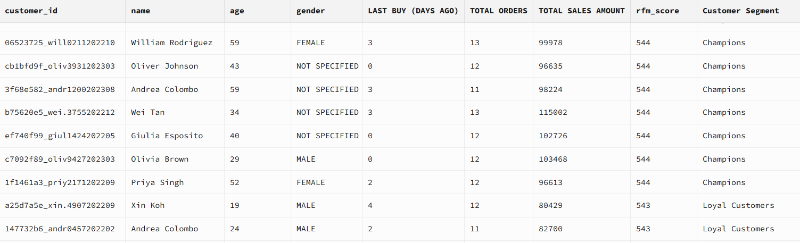

### Step 7: Retention and Churn Analysis

1. **Churn Rate Calculation**:
   - **Description**: Calculate the churn rate for customers based on their first transaction month.
   - **Core Functions**: `WITH` (CTE), `DATE_TRUNC`, `EXTRACT`, `COUNT`, `DENSE_RANK`, `GROUP BY`.
   - **Skills Gained**: Common Table Expressions (CTEs), date manipulation, aggregation, and window functions.
   ```sql
   WITH cohort_analysis AS (
       SELECT
           customer_id,
           DATE(DATE_TRUNC('month', MIN(order_date) OVER (PARTITION BY customer_id))) AS FirstTransactionMonth,
           EXTRACT(YEAR FROM AGE(order_date, MIN(DATE(order_date)) OVER (PARTITION BY customer_id))) * 12 +
           EXTRACT(MONTH FROM AGE(order_date, MIN(DATE(order_date)) OVER (PARTITION BY customer_id))) AS MonthsSinceFirstTransaction
       FROM orders
   ),
   cohort_counts AS (
       SELECT FirstTransactionMonth,
           COUNT(CASE WHEN MonthsSinceFirstTransaction = 0 THEN customer_id ELSE NULL END) AS Month_0,
           COUNT(CASE WHEN MonthsSinceFirstTransaction = 1 THEN customer_id ELSE NULL END) AS Month_1,
           COUNT(CASE WHEN MonthsSinceFirstTransaction = 2 THEN customer_id ELSE NULL END) AS Month_2,
           COUNT(CASE WHEN MonthsSinceFirstTransaction = 3 THEN customer_id ELSE NULL END) AS Month_3,
           COUNT(CASE WHEN MonthsSinceFirstTransaction = 4 THEN customer_id ELSE NULL END) AS Month_4,
           COUNT(CASE WHEN MonthsSinceFirstTransaction = 5 THEN customer_id ELSE NULL END) AS Month_5,
           COUNT(CASE WHEN MonthsSinceFirstTransaction = 6 THEN customer_id ELSE NULL END) AS Month_6,
           COUNT(CASE WHEN MonthsSinceFirstTransaction = 7 THEN customer_id ELSE NULL END) AS Month_7,
           COUNT(CASE WHEN MonthsSinceFirstTransaction = 8 THEN customer_id ELSE NULL END) AS Month_8,
           COUNT(CASE WHEN MonthsSinceFirstTransaction = 9 THEN customer_id ELSE NULL END) AS Month_9,
           COUNT(CASE WHEN MonthsSinceFirstTransaction = 10 THEN customer_id ELSE NULL END) AS Month_10,
           COUNT(CASE WHEN MonthsSinceFirstTransaction = 11 THEN customer_id ELSE NULL END) AS Month_11,
           COUNT(CASE WHEN MonthsSinceFirstTransaction = 12 THEN customer_id ELSE NULL END) AS Month_12,
           COUNT(CASE WHEN MonthsSinceFirstTransaction = 13 THEN customer_id ELSE NULL END) AS Month_13,
           COUNT(CASE WHEN MonthsSinceFirstTransaction = 14 THEN customer_id ELSE NULL END) AS Month_14,
           COUNT(CASE WHEN MonthsSinceFirstTransaction = 15 THEN customer_id ELSE NULL END) AS Month_15
       FROM cohort_analysis
       GROUP BY FirstTransactionMonth
       ORDER BY FirstTransactionMonth
   )
   SELECT
       TO_CHAR(FirstTransactionMonth, 'YYYY-Mon') AS COHORT_MONTH,
       Month_0,
       ROUND(1 - (Month_1::DECIMAL / NULLIF(Month_0, 0)), 2) AS Churn_1,
       ROUND(1 - (Month_2::DECIMAL / NULLIF(Month_0, 0)), 2) AS Churn_2,
       ROUND(1 - (Month_3::DECIMAL / NULLIF(Month_0, 0)), 2) AS Churn_3,
       ROUND(1 - (Month_4::DECIMAL / NULLIF(Month_0, 0)), 2) AS Churn_4,
       ROUND(1 - (Month_5::DECIMAL / NULLIF(Month_0, 0)), 2) AS Churn_5,
       ROUND(1 - (Month_6::DECIMAL / NULLIF(Month_0, 0)), 2) AS Churn_6,
       ROUND(1 - (Month_7::DECIMAL / NULLIF(Month_0, 0)), 2) AS Churn_7,
       ROUND(1 - (Month_8::DECIMAL / NULLIF(Month_0, 0)), 2) AS Churn_8,
       ROUND(1 - (Month_9::DECIMAL / NULLIF(Month_0, 0)), 2) AS Churn_9,
       ROUND(1 - (Month_10::DECIMAL / NULLIF(Month_0, 0)), 2) AS Churn_10,
       ROUND(1 - (Month_11::DECIMAL / NULLIF(Month_0, 0)), 2) AS Churn_11,
       ROUND(1 - (Month_12::DECIMAL / NULLIF(Month_0, 0)), 2) AS Churn_12,
       ROUND(1 - (Month_13::DECIMAL / NULLIF(Month_0, 0)), 2) AS Churn_13,
       ROUND(1 - (Month_14::DECIMAL / NULLIF(Month_0, 0)), 2) AS Churn_14,
       ROUND(1 - (Month_15::DECIMAL / NULLIF(Month_0, 0)), 2) AS Churn_15
   FROM cohort_counts
   ORDER BY FirstTransactionMonth;
   ```


### Step 8: Customer Lifetime Value(CLV) Analysis

1. **CLTV Calculation**:
  - **Description**:Calculate the Customer Lifetime Value (CLTV) for each cohort of customers.
  - **Core Functions**:WITH (CTE), DATE_TRUNC, EXTRACT, SUM, GROUP BY.
  - **Skills Gained**: Common Table Expressions (CTEs), date manipulation, aggregation, and window functions.
  ```sql
  WITH customer_orders AS (
    SELECT
        o.customer_id,
        DATE_TRUNC('month', o.order_date) AS order_month,
        gt.grand_total
    FROM orders o
    JOIN grand_total gt ON o.order_id = gt.order_id
  ),
  first_transactions AS (
      SELECT
          customer_id,
          MIN(order_month) AS first_transaction_month
      FROM customer_orders
      GROUP BY customer_id
  ),
  cohort_analysis AS (
      SELECT
          co.customer_id,
          ft.first_transaction_month,
          EXTRACT(YEAR FROM AGE(co.order_month, ft.first_transaction_month)) * 12 +
          EXTRACT(MONTH FROM AGE(co.order_month, ft.first_transaction_month)) AS months_since_first,
          co.grand_total
      FROM customer_orders co
      JOIN first_transactions ft ON co.customer_id = ft.customer_id
  ),
  customer_lifetime_value AS (
      SELECT
          first_transaction_month,
          SUM(CASE WHEN months_since_first = 0 THEN grand_total ELSE 0 END) AS Month_0,
          SUM(CASE WHEN months_since_first = 1 THEN grand_total ELSE 0 END) AS Month_1,
          SUM(CASE WHEN months_since_first = 2 THEN grand_total ELSE 0 END) AS Month_2,
          SUM(CASE WHEN months_since_first = 3 THEN grand_total ELSE 0 END) AS Month_3,
          SUM(CASE WHEN months_since_first = 4 THEN grand_total ELSE 0 END) AS Month_4,
          SUM(CASE WHEN months_since_first = 5 THEN grand_total ELSE 0 END) AS Month_5,
          SUM(CASE WHEN months_since_first = 6 THEN grand_total ELSE 0 END) AS Month_6,
          SUM(CASE WHEN months_since_first = 7 THEN grand_total ELSE 0 END) AS Month_7,
          SUM(CASE WHEN months_since_first = 8 THEN grand_total ELSE 0 END) AS Month_8,
          SUM(CASE WHEN months_since_first = 9 THEN grand_total ELSE 0 END) AS Month_9,
          SUM(CASE WHEN months_since_first = 10 THEN grand_total ELSE 0 END) AS Month_10,
          SUM(CASE WHEN months_since_first = 11 THEN grand_total ELSE 0 END) AS Month_11,
          SUM(CASE WHEN months_since_first = 12 THEN grand_total ELSE 0 END) AS Month_12,
          SUM(CASE WHEN months_since_first = 13 THEN grand_total ELSE 0 END) AS Month_13,
          SUM(CASE WHEN months_since_first = 14 THEN grand_total ELSE 0 END) AS Month_14,
          SUM(CASE WHEN months_since_first = 15 THEN grand_total ELSE 0 END) AS Month_15
      FROM cohort_analysis
      GROUP BY first_transaction_month
      ORDER BY first_transaction_month
  )
  SELECT TO_CHAR(first_transaction_month, 'YYYY-Mon') AS cohort_month, Month_0, Month_1, Month_2, Month_3, Month_4, Month_5, Month_6, Month_7, Month_8, Month_9, Month_10, Month_11, Month_12, Month_13, Month_14, Month_15
  FROM customer_lifetime_value;

  ```
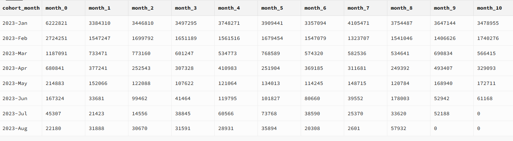

# Product Analysis

## Target
Analyze product trends to optimize marketing strategies and improve customer retention.


### Step 1: Product Popularity Analysis

1. **Highest/Lowest Sales Volume**:
   - **Description**: Calculate the total quantity sold for each product.
   - **Core Functions**: `SUM`, `GROUP BY`, `ORDER BY`.
   - **Skills Gained**: Aggregation, grouping, and ordering.
   ```sql
   SELECT
       OI.PRODUCT_ID,
       product_name,
       SUM(quantity) AS TOTAL_SOLD_QTY
   FROM order_items OI
   LEFT JOIN all_unique_products AUP ON OI.product_id = AUP.product_id
   GROUP BY OI.product_id, product_name
   ORDER BY TOTAL_SOLD_QTY DESC;
   ```
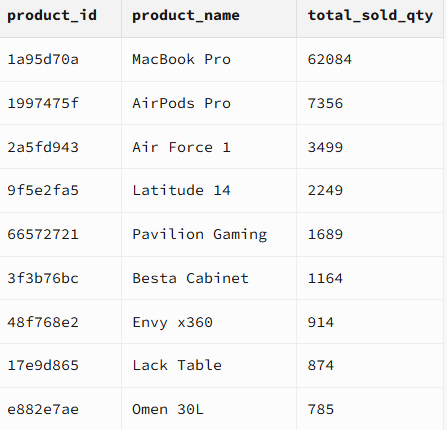

2. **Distribution of Product Prices and Costs**:
   - **Description**: Calculate the average price, cost, total sold quantity, and revenue for each product category.
   - **Core Functions**: `ROUND`, `AVG`, `SUM`, `GROUP BY`, `ORDER BY`.
   - **Skills Gained**: Aggregation, numerical rounding, and joining multiple tables.
   ```sql
   SELECT
       category_name,
       ROUND(AVG(price)::numeric, 2) AS AVG_PRICE,
       ROUND(AVG(cost)::numeric, 2) AS AVG_COST,
       SUM(quantity) AS TOTAL_SOLD_QUANTITY,
       ROUND(SUM(price * quantity)::numeric) AS REVENUE
   FROM order_items OI
   LEFT JOIN all_unique_products AUP ON OI.product_id = AUP.product_id
   LEFT JOIN product_subcategory PS ON AUP.subcategory_id = PS.subcategory_id
   LEFT JOIN product_category PC ON PS.category_id = PC.category_id
   GROUP BY PC.category_name
   ORDER BY TOTAL_SOLD_QUANTITY DESC, REVENUE DESC;
   ```
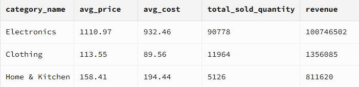

### Step 2: Product Recommendation Opportunities

1. **Frequently Purchased Products**:
   - **Description**: Identify products that are frequently purchased together.
   - **Core Functions**: `WITH` (CTE), `JOIN`, `COUNT`, `GROUP BY`, `HAVING`.
   - **Skills Gained**: Common Table Expressions (CTEs), joining tables, aggregation, and filtering.
   ```sql
   WITH order_products AS (
       SELECT order_id, product_id
       FROM order_items
   ),
   product_pairs AS (
       SELECT
           p1.product_id AS product_1,
           p2.product_id AS product_2,
           COUNT(*) AS times_bought_together
       FROM order_products p1
       JOIN order_products p2
           ON p1.order_id = p2.order_id AND p1.product_id < p2.product_id
       GROUP BY p1.product_id, p2.product_id
       HAVING COUNT(*) > 1
   )
   SELECT
       AUP1.product_name AS product_1,
       AUP2.product_name AS product_2,
       times_bought_together
   FROM product_pairs pp
   JOIN all_unique_products AUP1 ON pp.product_1 = AUP1.product_id
   JOIN all_unique_products AUP2 ON pp.product_2 = AUP2.product_id
   ORDER BY times_bought_together DESC
   LIMIT 20;
   ```
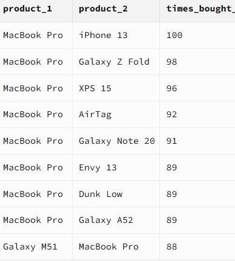

2. **Subcategory Combinations for Bundling**:
   - **Description**: Identify subcategory combinations that could be bundled to increase sales.
   - **Core Functions**: `WITH` (CTE), `JOIN`, `COUNT`, `GROUP BY`, `HAVING`.
   - **Skills Gained**: Common Table Expressions (CTEs), joining tables, aggregation, and filtering.
   ```sql
   WITH ORDER_PRODUCTS_SUB AS (
       SELECT
           order_id,
           subcategory_id
       FROM order_items OI
       JOIN all_unique_products AUP
           ON OI.product_id = AUP.product_id
   ),
   SUB_COMB AS (
       SELECT
           OPS1.subcategory_id AS subcategory_1,
           OPS2.subcategory_id AS subcategory_2,
           COUNT(*) AS FREQUENCY
       FROM ORDER_PRODUCTS_SUB OPS1
       JOIN ORDER_PRODUCTS_SUB OPS2
           ON OPS1.order_id = OPS2.order_id AND OPS1.subcategory_id < OPS2.subcategory_id
       GROUP BY OPS1.subcategory_id, OPS2.subcategory_id
       HAVING (COUNT(*) > 1)
   )
   SELECT
       PS1.subcategory_name AS SUBCATEGORY_1,
       PS2.subcategory_name AS SUBCATEGORY_2,
       FREQUENCY
   FROM SUB_COMB SC
   JOIN product_subcategory PS1 ON SC.SUBCATEGORY_1 = PS1.subcategory_id
   JOIN product_subcategory PS2 ON SC.SUBCATEGORY_2 = PS2.subcategory_id
   ORDER BY FREQUENCY DESC
   LIMIT 10;
   ```
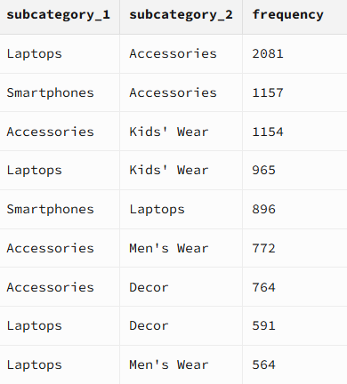

### Step 3: Pricing Strategy Analysis


1. **Price Impact Analysis**:
   - **Description**: Analyze the impact of price changes on revenue.
   - **Implementation Process**:
      1. **Create Monthly Product Data**: Aggregate data to calculate the average price, total quantity, and revenue for each product per month.
      2. **Calculate Lag Values**: Use the `LAG` function to get the previous month's values for price, quantity, and revenue.
      3. **Calculate Percentage Changes**: Compute the percentage change in price, quantity, and revenue between the current and previous month.
      4. **Filter Results**: Only include rows where the previous month's price is not null to avoid division by zero errors.
    - **Main Logic**:
      - The core logic involves time-series analysis to understand the impact of price changes. The `LAG` function is crucial for comparing current and previous values, and the percentage change calculations help in quantifying the impact.

   - **Core Functions**: `CREATE OR REPLACE FUNCTION`, `WITH` (CTE), `JOIN`, `LAG`, `ROUND`, `GROUP BY`.
   - **Skills Gained**: Function creation, Common Table Expressions (CTEs), window functions, and numerical rounding.
   ```sql
   CREATE OR REPLACE FUNCTION analyze_price_impact(product TEXT)
   RETURNS TABLE (
       product_name TEXT,
       month TEXT,
       avg_price NUMERIC,
       prev_price NUMERIC,
       price_change_pct NUMERIC,
       total_quantity INTEGER,
       prev_quantity INTEGER,
       quantity_change_pct NUMERIC,
       revenue NUMERIC,
       prev_revenue NUMERIC,
       revenue_change_pct NUMERIC
   )
   LANGUAGE SQL
   AS $$
   WITH monthly_product_data AS (
       SELECT
           oi.product_id,
           product_name,
           DATE_TRUNC('month', order_date) AS order_month,
           ROUND(AVG(price)::numeric, 2) AS avg_price,
           SUM(quantity) AS total_quantity,
           ROUND(SUM(price * quantity)::numeric, 2) AS revenue
       FROM orders o
       JOIN order_items oi ON o.order_id = oi.order_id
       JOIN all_unique_products p ON oi.product_id = p.product_id
       WHERE p.product_name = product
       GROUP BY oi.product_id, p.product_name, order_month
   ),
   price_trend AS (
       SELECT
           product_id,
           product_name,
           order_month,
           avg_price,
           total_quantity,
           revenue,
           LAG(avg_price) OVER (PARTITION BY product_id ORDER BY order_month) AS prev_price,
           LAG(total_quantity) OVER (PARTITION BY product_id ORDER BY order_month) AS prev_quantity,
           LAG(revenue) OVER (PARTITION BY product_id ORDER BY order_month) AS prev_revenue
       FROM monthly_product_data
   )
   SELECT
       product_name,
       TO_CHAR(order_month, 'YYYY-MON') AS month,
       avg_price,
       prev_price,
       ROUND((avg_price - prev_price) / NULLIF(prev_price, 0) * 100, 2) AS price_change_pct,
       total_quantity,
       prev_quantity,
       ROUND((total_quantity - prev_quantity) / NULLIF(prev_quantity, 0) * 100, 2) AS quantity_change_pct,
       revenue,
       prev_revenue,
       ROUND((revenue - prev_revenue) / NULLIF(prev_revenue, 0) * 100, 2) AS revenue_change_pct
   FROM price_trend
   WHERE prev_price IS NOT NULL
   ORDER BY product_id, order_month;
   $$;
   SELECT * FROM analyze_price_impact('Galaxy Tab S7');
   ```
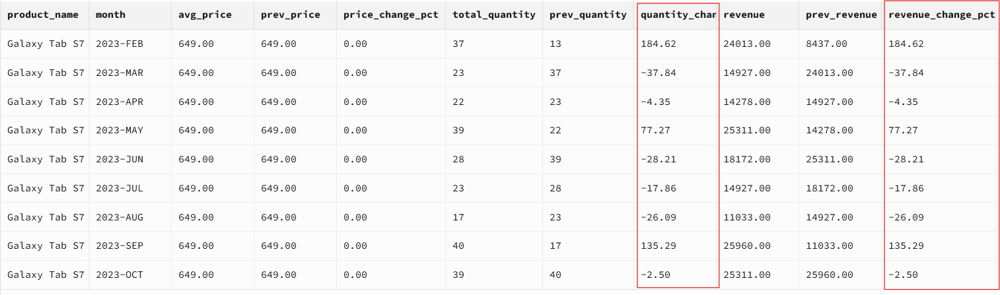

### Step 4: Anomaly Detection

1. **Outliers in Order Amount**:
   - **Description**: Identify outliers in order quantities that may indicate errors or fraud.
   
   - **Implementation Process**:
      1. **Calculate Percentiles**: Use the `PERCENTILE_CONT` function to determine the 25th (Q1) and 75th (Q3) percentiles of the order quantities.
      2. **Calculate IQR**: Compute the Interquartile Range (IQR) as the difference between Q3 and Q1.
      3. **Determine Bounds**: Calculate the lower and upper bounds using the formula `Q1 - 1.5 * IQR` and `Q3 + 1.5 * IQR`.
      4. **Identify Outliers**: Flag orders as 'Below (Possible Error)', 'Fraud', or 'Normal' based on whether the quantity falls outside the bounds.
   - **Main Logic**:
     - The core logic involves statistical calculations to identify outliers. The `PERCENTILE_CONT` function is used to find the quartiles, and the IQR is used to set the bounds for detecting anomalies. The `CASE` statement then categorizes each order based on its quantity.

   - **Core Functions**: `WITH` (CTE), `PERCENTILE_CONT`, `CROSS JOIN`, `CASE`.
   - **Skills Gained**: Common Table Expressions (CTEs), percentile calculation, and conditional logic.
   ```sql
   WITH stats AS (
       SELECT
           PERCENTILE_CONT(0.25) WITHIN GROUP (ORDER BY quantity) AS q1,
           PERCENTILE_CONT(0.75) WITHIN GROUP (ORDER BY quantity) AS q3
       FROM order_items
   ),
   iqr_calc AS (
       SELECT
           q1,
           q3,
           (q3 - q1) AS iqr,
           (q1 - 1.5 * (q3 - q1)) AS lower_bound,
           (q3 + 1.5 * (q3 - q1)) AS upper_bound
       FROM stats
   )
   SELECT
       o.order_id,
       o.customer_id,
       quantity,
       CASE
           WHEN quantity < I.lower_bound THEN 'Below (Possible Error)'
           WHEN quantity > I.upper_bound THEN 'Fraud'
           ELSE 'Normal'
       END AS status
   FROM orders O
   JOIN order_items OI ON O.order_id = OI.order_id
   CROSS JOIN iqr_calc I
   ORDER BY quantity DESC;
   ```

2. **Unusual Session Behavior**:
   - **Description**: Identify sessions with unusually short or long durations.

   - **Implementation Process**:
      1. **Calculate Mean and Standard Deviation**: Use the `AVG` and `STDDEV` functions to compute the mean and standard deviation of session durations.
      2. **Calculate Z-Scores**: Compute the z-score for each session duration using the formula `(session_duration - mean) / stddev`.
      3. **Identify Unusual Sessions**: Flag sessions as 'Unusual' if the absolute value of the z-score is greater than 3, otherwise flag as 'Normal'.
    - **Main Logic**:
      - The main logic here is to use statistical measures to identify sessions that deviate significantly from the norm. The z-score helps in determining how many standard deviations a session duration is from the mean, and sessions with high z-scores are flagged as unusual.

   - **Core Functions**: `WITH` (CTE), `AVG`, `STDDEV`, `CROSS JOIN`, `CASE`.
   - **Skills Gained**: Common Table Expressions (CTEs), standard deviation calculation, and conditional logic.
   ```sql
   WITH stats AS (
       SELECT
           AVG(session_duration) AS mean,
           STDDEV(session_duration) AS stddev
       FROM sessions
   ),
   z_score_calc AS (
       SELECT
           s.customer_id,
           s.session_id,
           s.session_duration,
           (s.session_duration - st.mean) / NULLIF(st.stddev, 0) AS z_score
       FROM sessions s
       CROSS JOIN stats st
   )
   SELECT
       customer_id,
       session_id,
       session_duration,
       CASE
           WHEN ABS(z_score) > 3 THEN 'Unusual'
           ELSE 'Normal'
       END AS session_status
   FROM z_score_calc
   ORDER BY z_score DESC;
   
   ```

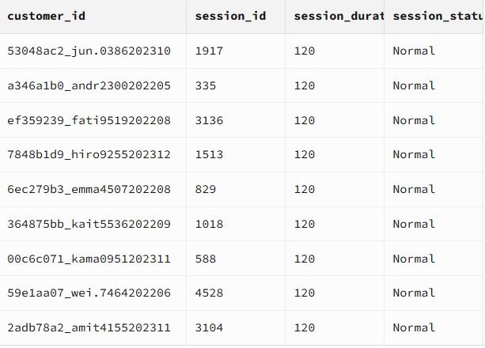


